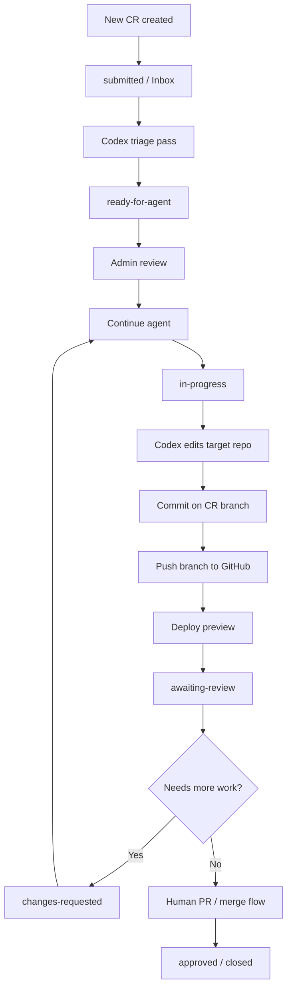
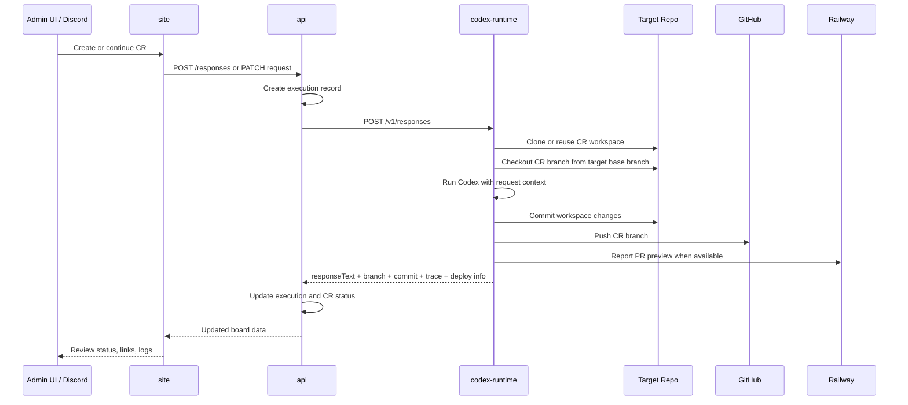
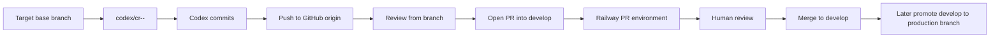
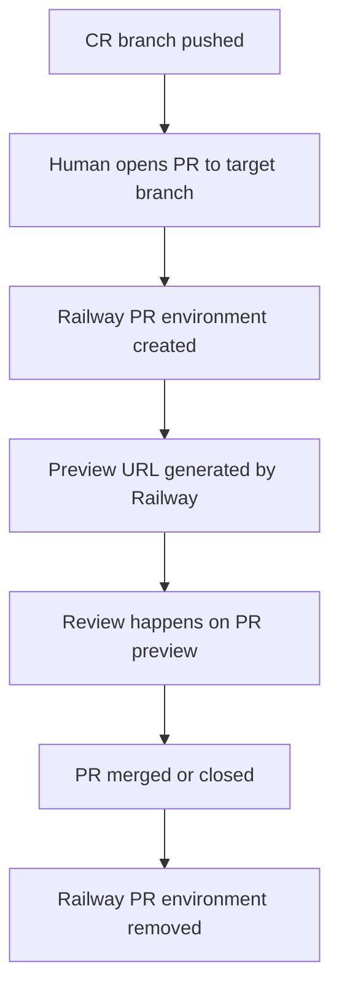
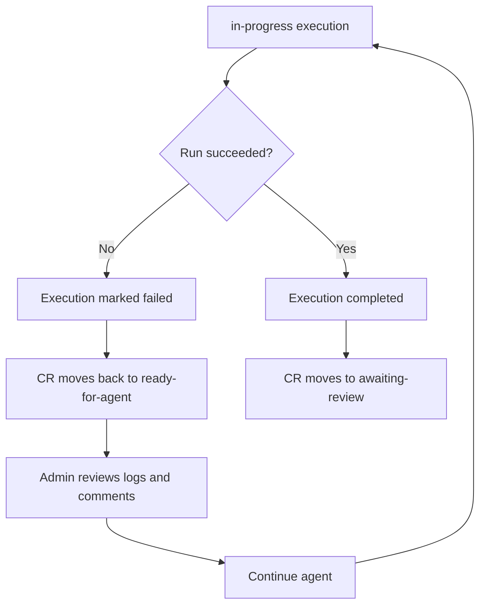
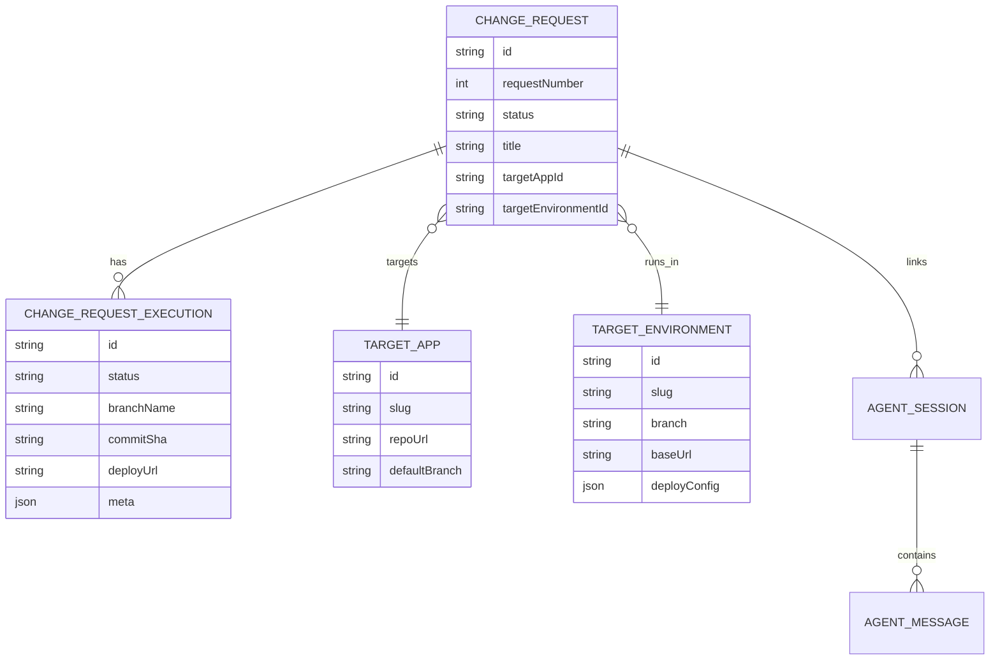

# Change Request Flow

This document shows the current Prism change-request flow as visual diagrams.

It focuses on:

- board state changes
- Codex execution flow
- GitHub branch and PR flow
- Railway PR preview paths

## At A Glance



## Board State Machine

```mermaid
stateDiagram-v2
    [*] --> submitted
    submitted --> triaging: Codex triage starts
    triaging --> ready-for-agent: Triage complete
    ready-for-agent --> in-progress: Admin continues run
    in-progress --> awaiting-review: Run completes
    in-progress --> ready-for-agent: Run fails / retry needed
    awaiting-review --> changes-requested: Review asks for changes
    changes-requested --> in-progress: Admin continues same CR branch
    awaiting-review --> approved: Human accepts result
    approved --> closed
    rejected --> closed
```

## Runtime Sequence



## Branch And PR Flow

Current working rule:

- new CRs should branch from the configured target environment branch first
- the target environment branch is operator-configured per app
- existing CRs resume from their own branch first



## Preview Paths

The template uses GitHub branches and Railway PR environments as the preferred preview path.



PR environment notes:

- Railway PR environments are project-scoped
- they are created when a GitHub PR is opened
- they are not created from branch existence alone
- the board should store the PR URL and preview URL when they are available

## Failure And Retry Flow



Typical failure classes:

- transport failure between `api` and `codex-runtime`
- target repo fetch or branch prep failure
- build or validation failure in target repo
- deploy failure in Railway

## Data Objects



## Current Review Surface

Today the board should surface:

- CR status
- latest execution summary
- runtime trace
- GitHub branch link
- GitHub compare / PR link
- Railway PR environment URL

Longer term it should also track:

- PR number and PR URL
- PR review state and requested-changes feedback
