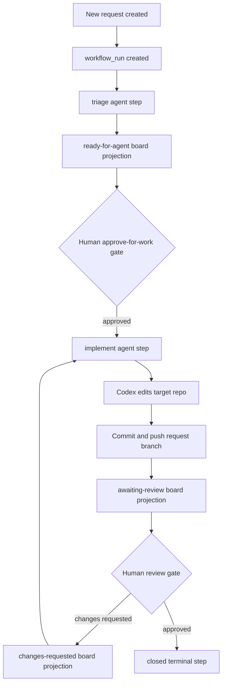
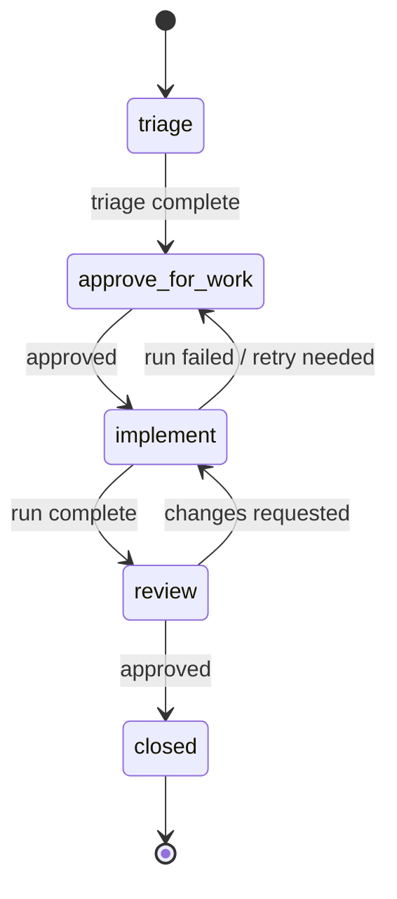
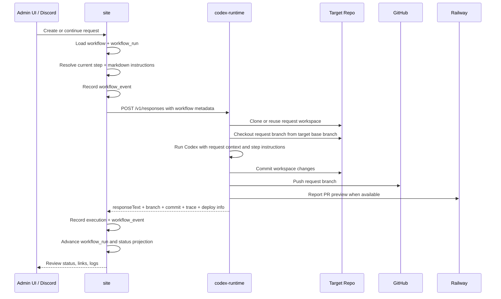
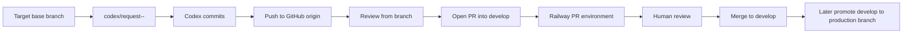
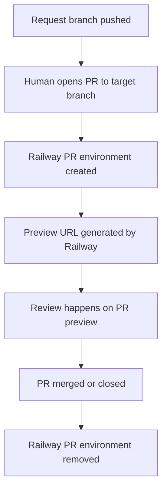
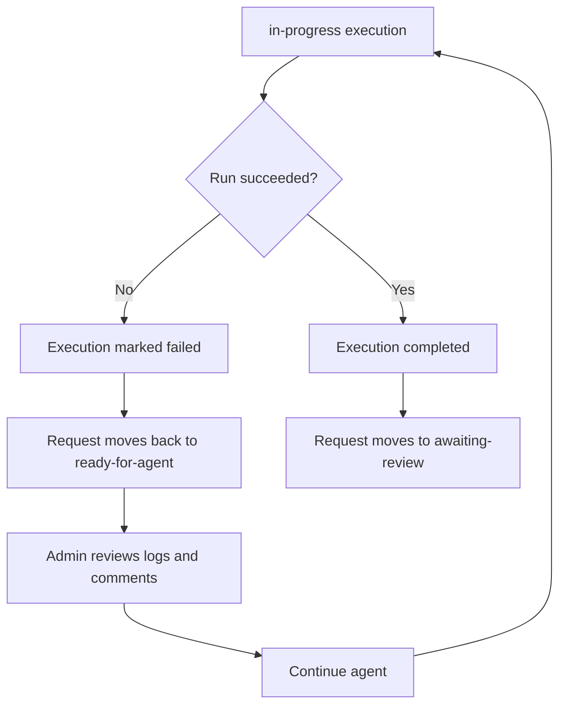
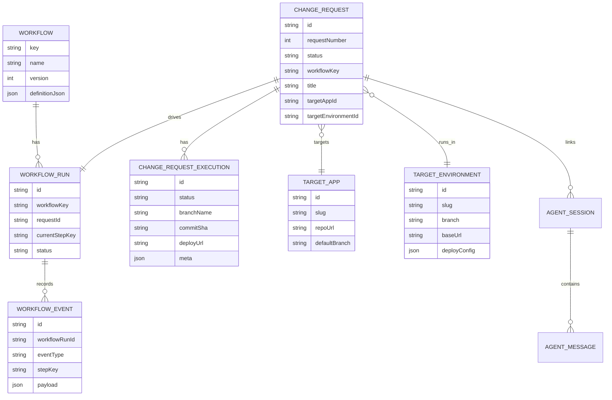

# Request Workflow Flow

This document shows the current Prism request flow as visual diagrams.

The older change-request board is now backed by the workflow engine. The database table is still named `change_requests`, but product language and UI should use **Requests**.

This focuses on:

- workflow state and board projection
- Codex execution flow
- GitHub branch and PR flow
- Railway PR preview paths
- workflow run/event records

## At A Glance

## Workflow Steps And Board Projection

The request `status` is still present because the board needs simple filters and labels. It is a coarse projection only; the workflow run's `current_step_key` is the source of truth.

The workflow run and event records are the durable workflow state. Manual step changes update the workflow run directly.

## Runtime Sequence

## Branch And PR Flow

Current working rule:

- new requests should branch from the configured target environment branch first
- the target environment branch is operator-configured per app
- existing requests resume from their own branch first

## Preview Paths

The template uses GitHub branches and Railway PR environments as the preferred preview path.

PR environment notes:

- Railway PR environments are project-scoped
- they are created when a GitHub PR is opened
- they are not created from branch existence alone
- the board should store the PR URL and preview URL when they are available

## Failure And Retry Flow

Typical failure classes:

- transport failure between `api` and `codex-runtime`
- target repo fetch or branch prep failure
- build or validation failure in target repo
- deploy failure in Railway

## Data Objects

## Current Review Surface

Today the board should surface:

- request status
- workflow step label
- workflow subway map
- workflow events in History
- latest execution summary
- runtime trace
- GitHub branch link
- GitHub compare / PR link
- Railway PR environment URL

Longer term it should also track:

- PR number and PR URL
- PR review state and requested-changes feedback
