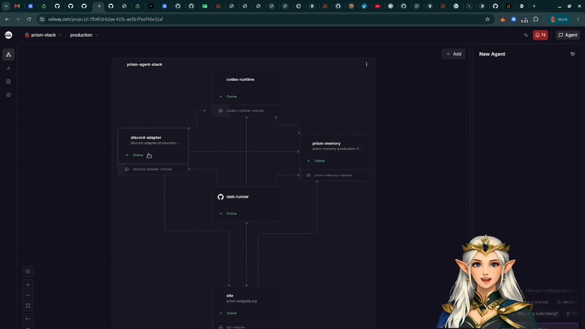
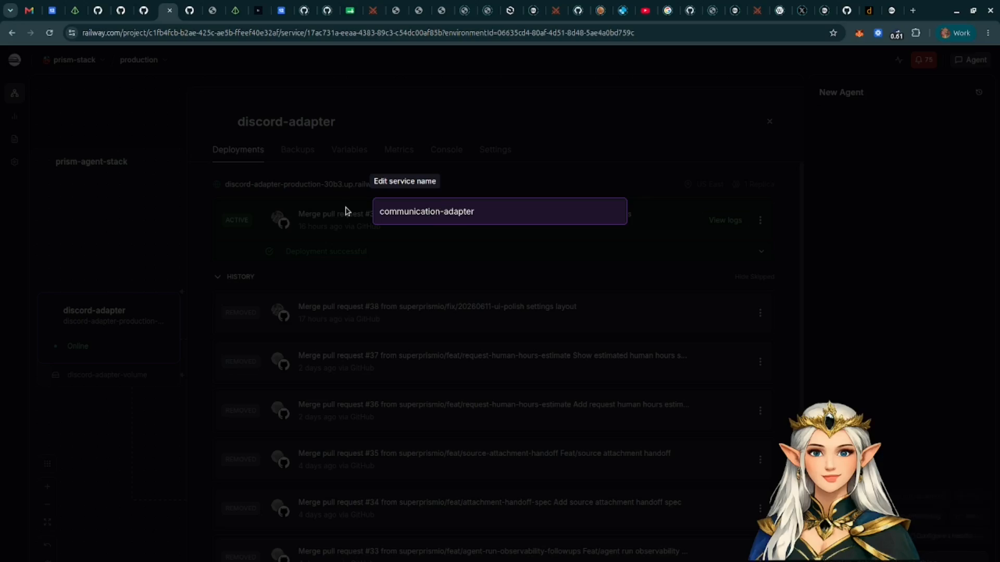
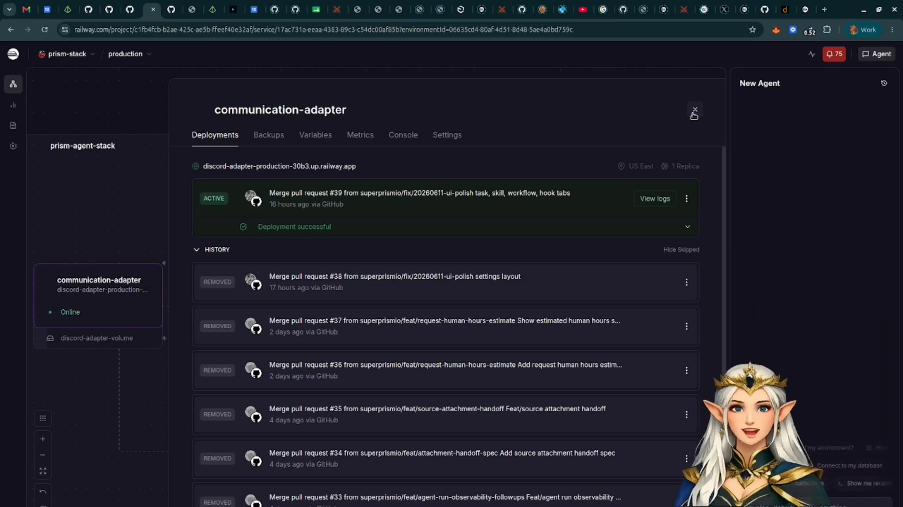
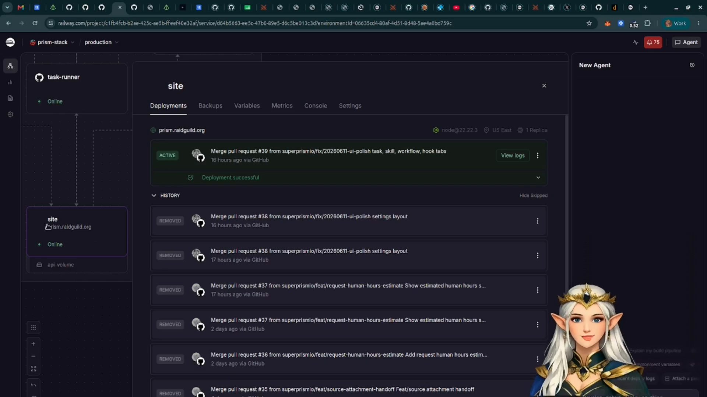

# Understand The Railway Template Services

The Prism Railway template deploys Prism as a set of cooperating services. This
page explains what each service is responsible for at a user/operator level.

Use this when you are looking at a Railway project and want to know which service
owns which part of Prism.

## Template Overview

The template provisions the main Prism services into one Railway project.

Each service has a narrow responsibility. Keeping them separate makes it easier
to configure, restart, and reason about the system.

## Codex Runtime

`codex-runtime` runs Codex-backed sessions for Prism.

Prism uses this service when an operator asks the agent to respond, triage, or
work through a workflow step. It keeps the Codex execution surface separate from
the site UI and request state.

## Communication Adapter

The communication adapter connects external chat surfaces to Prism.

For Discord deployments, this service handles bot transport, slash commands,
thread or mention routing, and Discord-specific features. The same role can be
extended for other communication surfaces.

## Task Runner

`task-runner` handles scheduled and repeatable work.

Tasks can be agent-backed, such as asking Prism to draft a recurring update, or
deterministic, such as running a script on a schedule.

## Site And Prism Memory

`site` is the web app and API front door. Prism Memory owns collected memory,
knowledge sources, generated state, and memory APIs.

The admin UI, request board, workflows, skills, hooks, and operator-facing API
routes live in `site`. Memory collection, digests, knowledge indexing, and
memory reads live in Prism Memory.

## Service Map

- `site`: admin UI, request board, workflows, skills, hooks, app API, and
  instance-owned state.
- `codex-runtime`: Codex execution sessions used by chat and workflow steps.
- `communication-adapter`: Discord, Telegram, or other chat transport.
- `task-runner`: scheduled tasks and recurring automation.
- `prism-memory`: rolling memory, knowledge sources, digests, and memory APIs.

For deeper deployment details, see `docs/operations/railway-setup.md` and
`docs/operations/template-deploy-runbook.md` in this repository.
