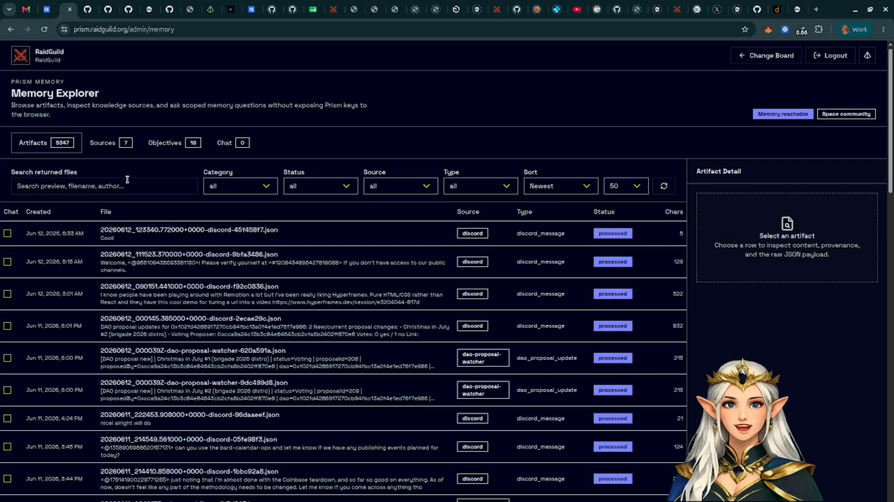
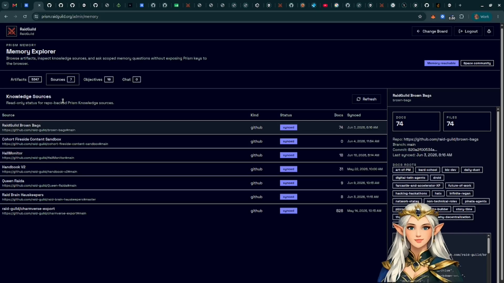
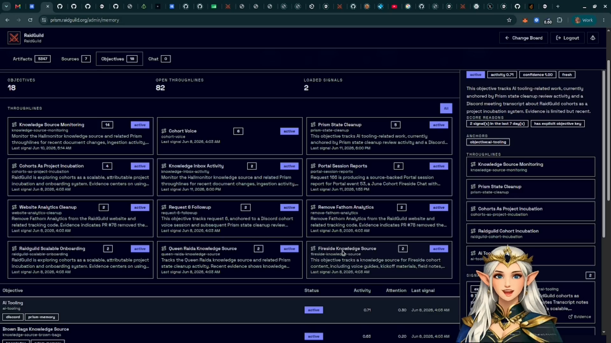
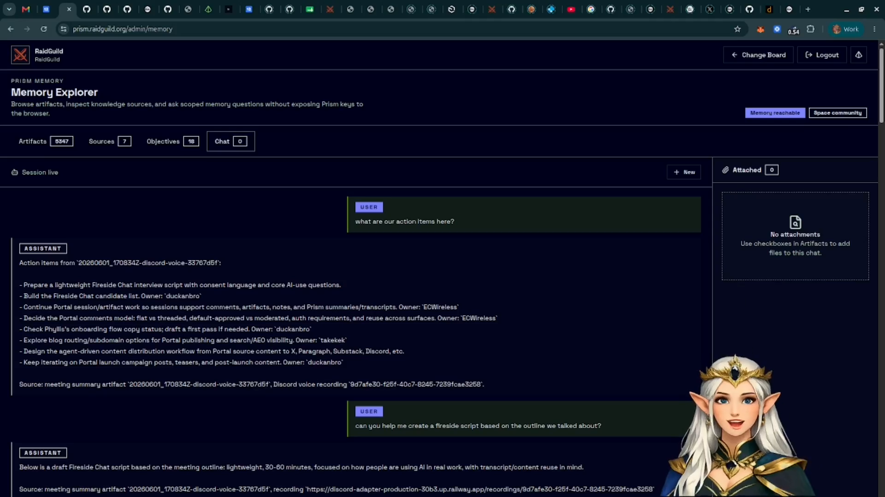

# Use Memory Explorer

Memory Explorer lets operators inspect Prism Memory, browse knowledge sources,
review generated state, and ask questions against selected memory context.

Use this when you want to understand what Prism knows before asking an agent to
write, summarize, triage, or plan work.

## Open Memory Explorer

From the admin workspace, select **Memory** in the top navigation.

Memory Explorer is available when the site service can reach Prism Memory. If it
is not configured, the admin page shows the missing environment setup.

## Browse Memory Artifacts

The **Artifacts** view shows collected and generated memory files. These can
include Discord collection outputs, digests, summaries, and other stored
artifacts from memory jobs.

Use filters to narrow by category, status, source, tags, or sort order. Select
an artifact to inspect its details.

## Review Knowledge Sources

The **Sources** view lists longer-lived knowledge inputs. These are different
from rolling memory: knowledge sources are meant to be evergreen project,
community, or product references.

GitHub-backed sources can be refreshed so Prism Memory can pull the latest repo
content into its local searchable index.

## Inspect Objectives And Signals

The **Objectives** and **Signals** views summarize recurring topics, active work,
and patterns Prism has inferred from memory.

Treat this as an operator aid. It helps surface what is active or repeatedly
discussed, but it should still be reviewed before using it as source material.

## Ask Questions With Selected Context

Use **Chat** when you want a focused answer from a specific artifact, source, or
set of selected records.

Attach the records you want the answer to consider, then ask a specific
question. This keeps the context smaller and makes the answer easier to verify.

## How Memory Differs From Knowledge

Memory is rolling and activity-based. It captures recent community or project
activity and rolls that activity into digests and summaries over time.

Knowledge is longer-lived reference material. It is better for handbooks,
project docs, repositories, and stable source material.

Prism uses a file-first approach for this layer. Instead of starting from a
vector database as the primary source of truth, Prism Memory keeps artifacts and
knowledge as files and indexes them for search.
