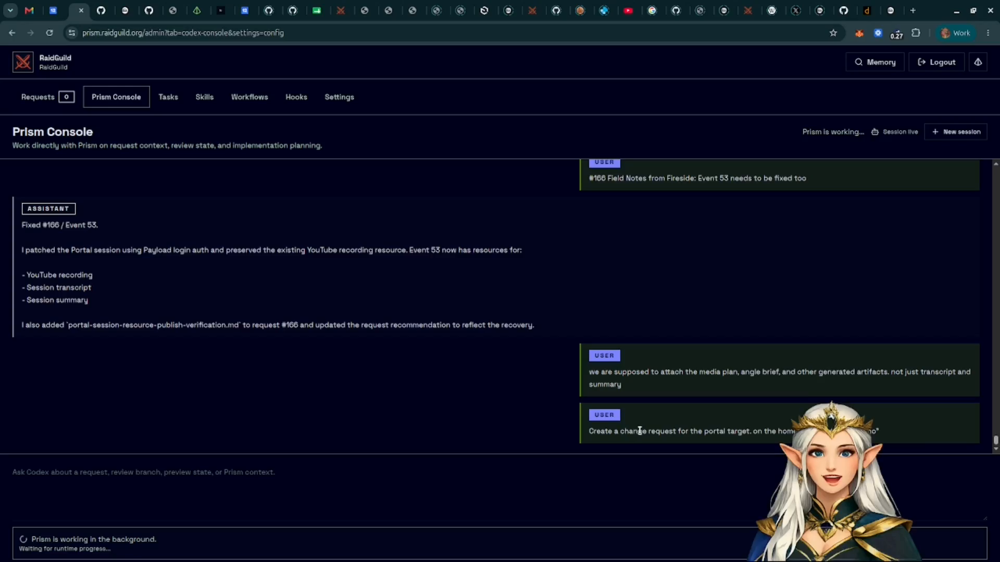
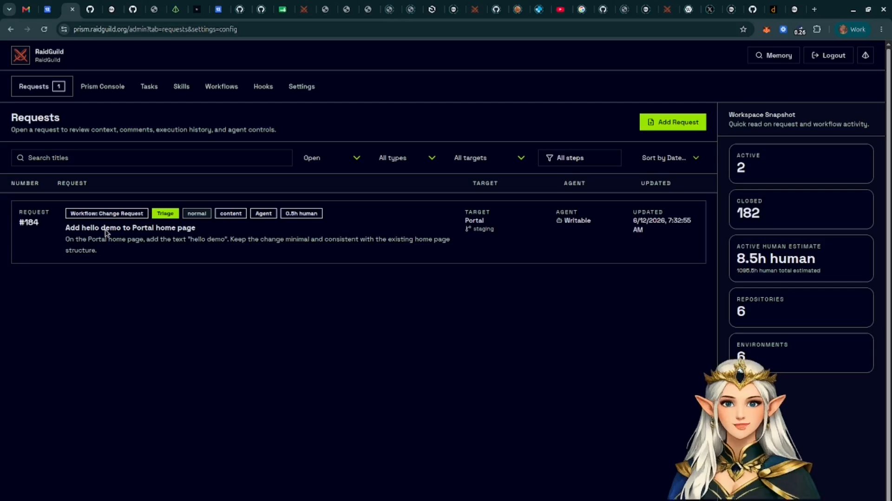
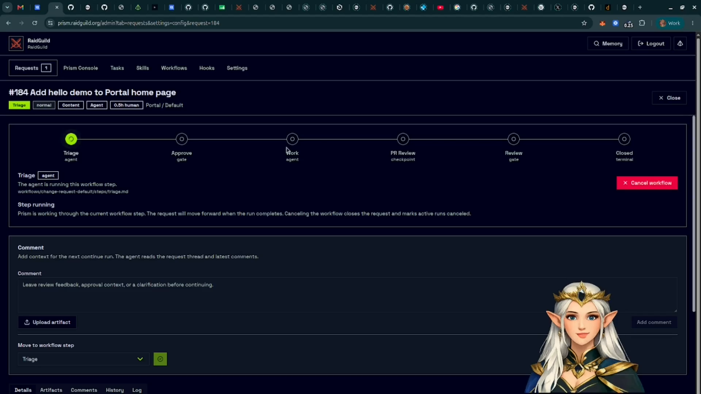
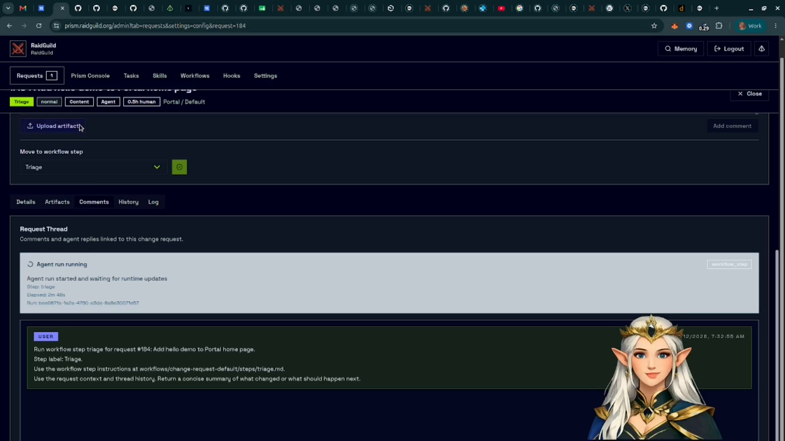
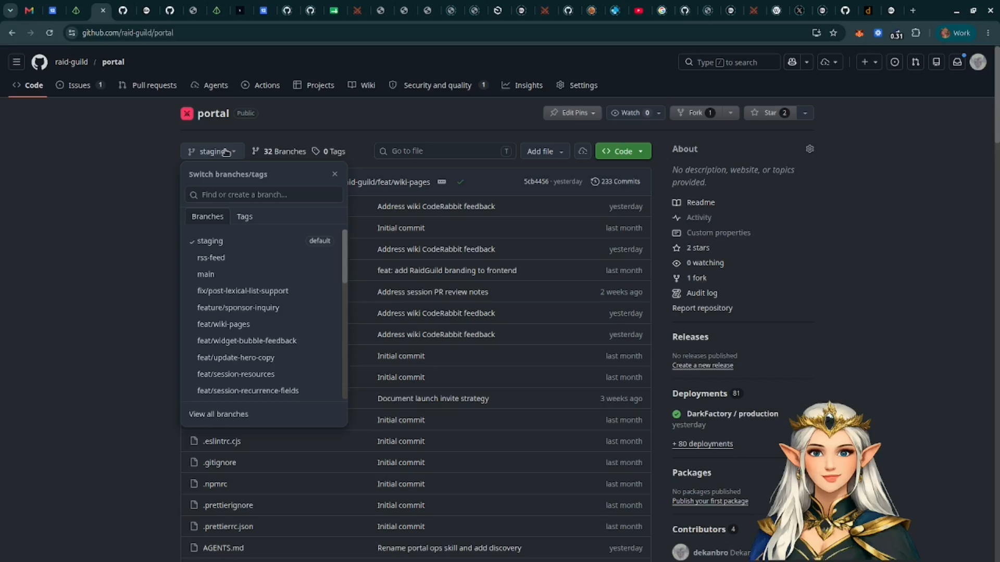
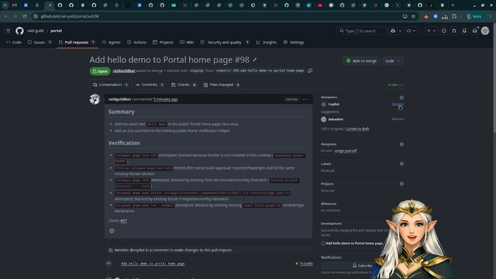
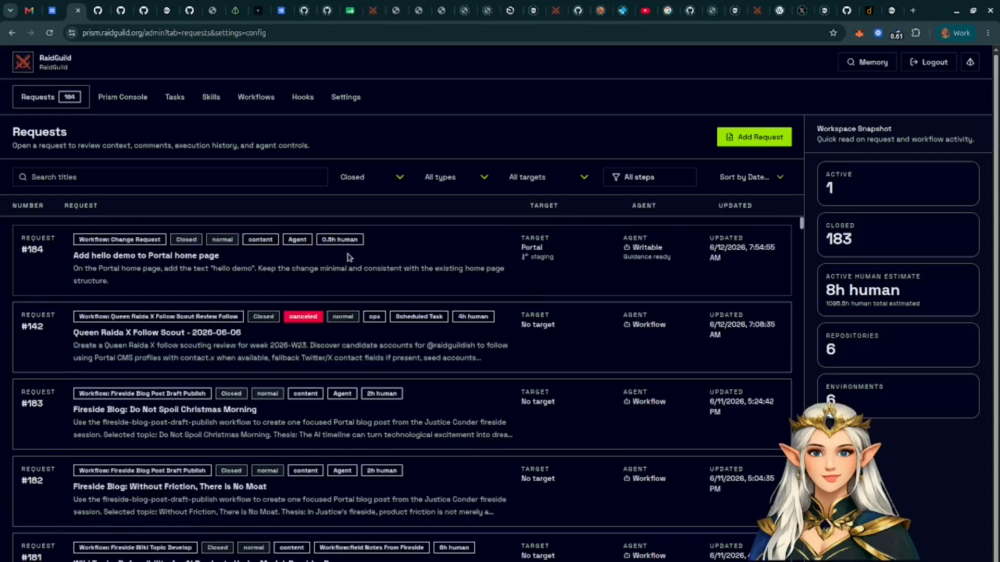

# Create And Run Your First Change Request

This tutorial walks through creating a Prism request, watching it move through a
workflow, and reviewing the work that the agent produces.

Use this when you want to understand the normal operator path from "I need a
change" to "the request is ready for review."

## What You Need

- Access to the Prism admin workspace.
- At least one configured target app.
- A target environment for the app.
- A clear change request that can be described in one or two sentences.

The walkthrough example asks Prism to add a small hello/demo section to a portal
home page.

## 1. Create The Request

Open the Prism Console and describe the change you want. Include the target app
and the outcome you expect.

Prism creates a numbered request and links it to the selected target app and
environment.

## 2. Open The Request

Go to **Requests** and open the new request from the list.

The list shows the request number, title, target, current workflow step, agent,
and last update time. The workspace snapshot on the right summarizes the current
request load and estimated human time.

## 3. Read The Workflow State

The request detail page shows the active workflow as a horizontal step tracker.
In the default change request workflow, a request moves through triage, approval,
implementation, PR review, final review, and closure.

Some steps run automatically through the agent. Gate steps pause for a human
operator to approve, request changes, or move the request to another step.

## 4. Add Context Before Continuing

Use the request thread to leave comments for the agent. Attach files when the
agent needs screenshots, design notes, markdown, JSON, or other supporting
material.

Comments and artifacts become part of the request context for later workflow
steps.

## 5. Review Generated Work

As the agent works, Prism records comments, artifacts, history, and logs on the
request.

Use these areas to answer four questions:

- What did the agent decide to do?
- What files or app areas changed?
- Did it create a branch, issue, pull request, or preview?
- Does the next workflow step need human approval?

## 6. Continue Or Request Changes

At a human gate, review the current request state and choose the next action.

Use **Approve and continue** when the request is ready for the next workflow
step. Use the change/request controls when the agent needs more work before the
request should advance.

## 7. Confirm Completion

When the workflow finishes, the step tracker reaches the closed state and the
request returns to the list as completed or closed.

From here, review the linked branch, issue, pull request, preview, or artifacts
depending on how your target app is configured.

## What You Learned

You created a request, opened the request detail page, inspected workflow state,
added operator context, reviewed generated artifacts, approved a human gate, and
confirmed the request in the request list.

For a deeper implementation-level explanation, see
`docs/features/change-request-flow.md` in this repository.
